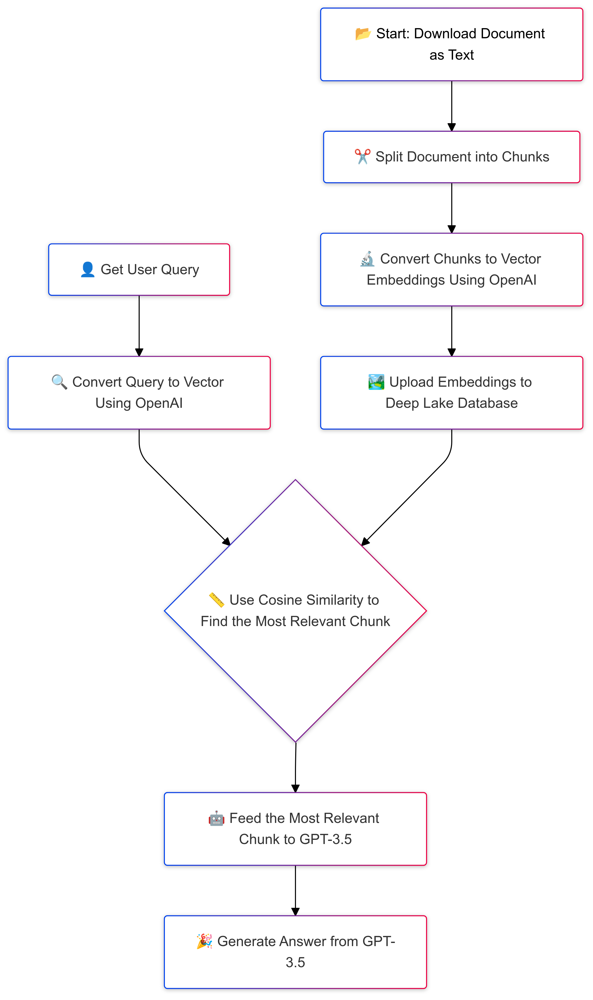

# RAG-based Question Answering Chatbot using Deep Lake, LangChain, and GPT-3.5

This project implements a **Retrieval-Augmented Generation (RAG)** chatbot that enables interactive communication with user-provided text files using **LLM** and **retrieval-based techniques**. The chatbot answers user questions by retrieving the most relevant information from a document and generating natural language responses using **GPT-3.5 Turbo**.

The system is highly customizable, allowing the LLM to be tailored based on the user’s text files. This approach enhances the chatbot’s ability to generate precise, context-aware responses by grounding the LLM in user-provided content. The pipeline includes document chunking, vectorizing with embeddings, storing embeddings in a vector database, and querying to generate accurate responses.

---

## Technologies Used

|  |  |  |  |
|:--:|:--:|:--:|:--:|
| [Deep Lake](https://deeplake.ai/) | [Activeloop](https://activeloop.ai/) | [LangChain](https://www.langchain.com/) | [GPT-3.5](https://beta.openai.com/docs/models/gpt-3-5) |

---

## Features

- **Document Handling:** Download and split large text files into smaller chunks for easier processing.
- **Vector Embeddings:** Use **OpenAI embeddings** to convert text chunks into high-dimensional vectors.
- **Deep Lake Database Integration:** Store, retrieve, and manage vector embeddings in a **Deep Lake** vector database.
- **GPT-3.5 Answer Generation:** Retrieve the most relevant text chunk and generate context-aware responses with **GPT-3.5**.
- **Cosine Similarity Matching:** Efficiently find the most relevant text chunk to answer the user’s query.
- **Customizable LLM:** Enables user-provided documents to enhance the LLM’s contextual accuracy.

---

## Installation

1. **Clone the repository:**
    ```bash
    git clone https://github.com/amirhosseinazami1373/RAG--based-Question-answering-chatbot-.git
    cd your-repo
    ```

2. **Install dependencies:**
    ```bash
    pip install -r requirements.txt
    ```

3. ## Add Your API Keys as Environment Variables

To access **OpenAI** and **Deep Lake APIs**, set your API keys as environment variables. This ensures secure access and prevents hard-coding sensitive information in the code.

### For Mac/Linux:
Open your terminal and run:
```bash
export OPENAI_API_KEY="your-openai-api-key"
export DEEPLAKE_API_KEY="your-deeplake-api-key"
 ```
### For Windows (Command Prompt):

```bash
set OPENAI_API_KEY="your-openai-api-key"
set DEEPLAKE_API_KEY="your-deeplake-api-key"
```
### For Windows (PowerShell):

```bash
$env:OPENAI_API_KEY="your-openai-api-key"
$env:DEEPLAKE_API_KEY="your-deeplake-api-key"
```
---

## Usage:

1. **Prepare the Vector Database:**
   Open the `Vectordatabse.ipynb` file and run the code. This will:
   - Download the text data from the specified link (replaceable with any other text URL).
   - Split the text into smaller chunks.
   - Generate vector embeddings using OpenAI’s `text-embedding-ada-002` model.
   - Store the embeddings in a **Deep Lake** vector database for fast querying.

2. **Run the Similarity and LLM Call:**
   Open and run the `similarity_LLM.ipynb` file, which performs the following steps:
   - **Query Input:** Captures a user query through an input prompt.
   - **Embed the Query:** Converts the query into a vector using OpenAI embeddings.
   - **Cosine Similarity Matching:** Compares the query vector with the stored embeddings in the Deep Lake database to find the most relevant chunk.
   - **Retrieve Relevant Content:** Extracts the text corresponding to the highest similarity score.
   - **Prompt Formatting:** Creates a prompt with the relevant chunk to guide the GPT-3.5 model.
   - **LLM Call:** Uses GPT-3.5 Turbo to generate a natural language response based on the relevant chunk.
   

3. **Run the Streamlit App for a User-Friendly Interface:**
After creating the vector database, users can switch to a more graphical interface using Streamlit. This interface makes it easier to query the chatbot and view responses interactively. To launch the Streamlit app, run the following command in the terminal:
    ```bash
    streamlit run RAG_1.py
    ```
---
## Application Workflow: 
   - **Document Processing:** The application downloads the specified text document and splits it into smaller chunks.
   - **Embeddings Generation:** Each chunk is converted into vector embeddings using OpenAI's `text-embedding-ada-002` model.
   - **Storing Embeddings:** The vector embeddings are uploaded to a **Deep Lake** database.
   - **Querying:** Users input their queries, which are converted into vectors. **Cosine similarity** is used to match the query with the most relevant text chunk.
   - **Answer Generation:** The matched chunk is fed into **GPT-3.5** to generate a response tailored to the query.
Below is the flowchart showing the workflow of the RAG-based chatbot system:

 
---

## Example Query:

**Query:**

```text
 "What was Sherlock doing in this story??"
```
**Response:** 
```text
"Sherlock Holmes was examining the pathway and the surrounding area for clues and evidence related to the mystery at hand. He was also observing the behavior and actions of the police and other individuals involved in the case."
```


